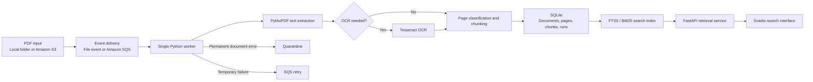

# Pharmaceutical Document Ingestion Pipeline

An event-driven data pipeline for pharmaceutical PDFs. It extracts digital text, uses optical character recognition (OCR) when needed, keeps page-level source lineage, and builds a searchable keyword index.

Processing starts when a PDF arrives locally or in Amazon S3. Repeated events do not create duplicate records, changed files become new document versions, and failed files do not stop other work.

## Pipeline



A chunk is a smaller text section used for search. Source lineage links every chunk to its exact document version and page. SQLite full-text search (FTS5) stores the keyword index, and BM25 ranks matching chunks.

## Key Technologies

| Area | Technology | Role |
| --- | --- | --- |
| Event input | Amazon S3, Amazon SQS, Watchdog | Detect and queue new PDFs |
| PDF extraction | PyMuPDF | Read embedded digital text |
| OCR fallback | Tesseract, Pillow | Read scanned or corrupted-text pages |
| Processing | Python | Validate, classify, chunk, and route files |
| State and lineage | SQLite | Store runs, versions, pages, chunks, and errors |
| Retrieval | SQLite FTS5 with BM25 | Search current document versions |
| Serving | FastAPI, Gradio | Expose retrieval through JSON and a browser interface |
| Cloud access | Boto3 | Download exact S3 object versions and manage queue messages |
| Testing | Pytest | Verify ingestion, OCR, indexing, and S3/SQS behavior |

## Engineering Highlights

- **Idempotent ingestion:** SHA-256 file fingerprints prevent duplicate records when local or cloud events repeat.
- **Immutable versions:** updated PDFs create new versions while older records remain available for audit.
- **Conditional OCR:** digital text is kept when reliable; scanned or suspicious pages route to Tesseract.
- **Failure isolation:** invalid PDFs move to quarantine, while temporary failures remain available for retry.
- **Transactional indexing:** new chunks and FTS5 search entries commit in the same SQLite transaction.
- **Exact source tracking:** cloud records keep the S3 object version, document hash, and page number.
- **Separate serving boundary:** FastAPI exposes the retrieval contract, while Gradio remains a replaceable client.

## Verified Results

| Evaluation | Result |
| --- | ---: |
| Live S3/SQS corpus run | 16 PDFs, 430 pages, 1,987 chunks |
| Cloud run failures | 0 |
| OCR fallback pages in cloud run | 1 |
| Automated tests | 71 passed |
| Retrieval experiment | 21 configurations, 80 labeled questions |
| BM25 test Recall@5 | 100% on 16 held-out questions |
| Hybrid test Recall@5 | 87.5% on the same questions |
| Retrieval p95 latency | 1.17 ms BM25, 11.74 ms hybrid |
| OCR routing stress test | recall improved from 38.71% to 100% on 38 controlled cases |

Recall@5 measures whether the correct page appears in the first five results. The p95 value is the time at or below which 95% of measured queries finished. These are development results from the documented corpus and test sets, not general production guarantees.

### Why BM25 Instead of a Vector Database?

The project tested MiniLM, BGE-small, and E5-small embeddings with vector and hybrid retrieval. Boundary-aware BM25 performed better on acceptance data and the untouched test set. It was also faster at the measured 1,987-chunk scale, so PostgreSQL/pgvector would add infrastructure without a measured retrieval gain.

See [Retrieval Evaluation](docs/retrieval-evaluation.md) for the full comparison and limits.

## Quick Start

Requirements: Python 3.10+ and the Tesseract command-line program.

```bash
python3 -m venv .venv
source .venv/bin/activate
pip install -e '.[dev]'

pharma-pipeline init
pharma-pipeline ingest /path/to/document.pdf
pharma-pipeline search "What must be completed before commercial distribution?" --top-k 5
```

See [Setup and Commands](docs/setup.md) for local watching, AWS credentials, S3/SQS processing, corpus downloads, evaluations, and tests.

## Current Scope

The verified design uses one worker and SQLite. The S3/SQS input path is deployed, but the worker runs from a development machine rather than as an always-on hosted service. Concurrent cloud workers would require shared state such as PostgreSQL and a new round of ingestion and retrieval tests.

## Documentation

| Document | Contents |
| --- | --- |
| [Setup and Commands](docs/setup.md) | Installation, credentials, worker commands, corpus tools, and tests |
| [Architecture](docs/architecture.md) | Data flow, schemas, event handling, OCR routing, and indexing |
| [Decision Log](docs/decision-log.md) | Design choices, evidence, and trade-offs |
| [Operations](docs/operations.md) | Metrics, health checks, failures, and recovery |
| [S3/SQS Integration](docs/s3-handoff.md) | AWS configuration, message handling, and live verification |
| [Retrieval Evaluation](docs/retrieval-evaluation.md) | Labels, compared configurations, metrics, and limits |
| [Development Verification](docs/development-verification.md) | Test results and measured pipeline evidence |
| [Resume Evidence](docs/resume-evidence.md) | Reproducible claims and interview stories |
| [Corpus](corpus/README.md) | FDA source records, hashes, and OCR stress-set design |
