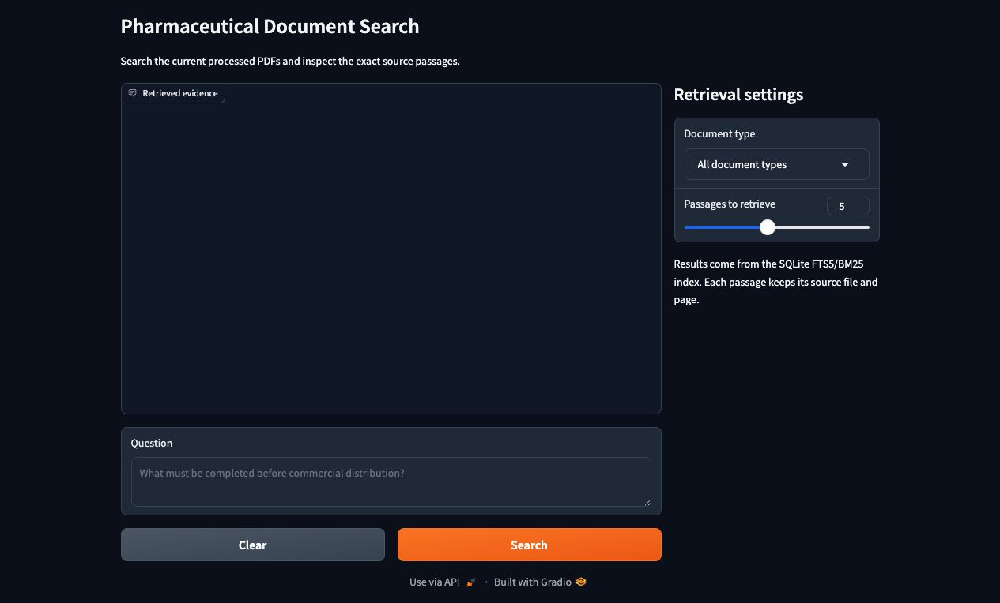
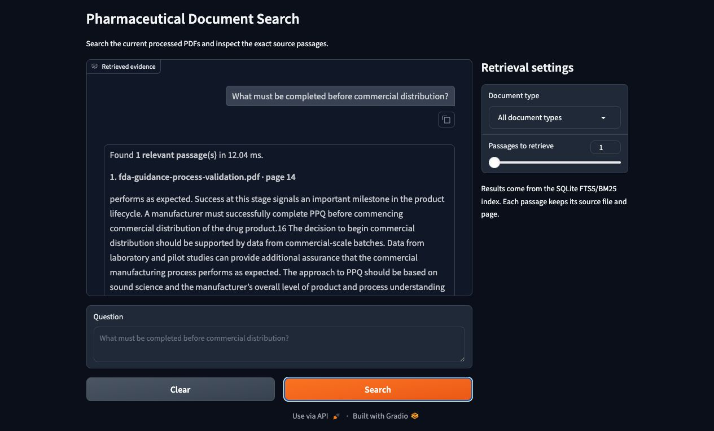
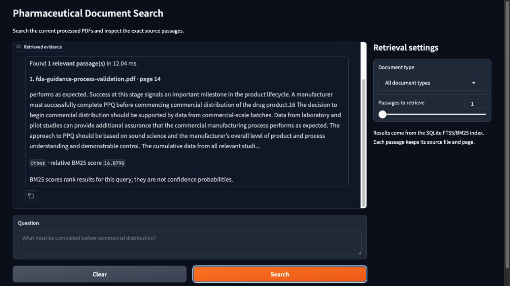
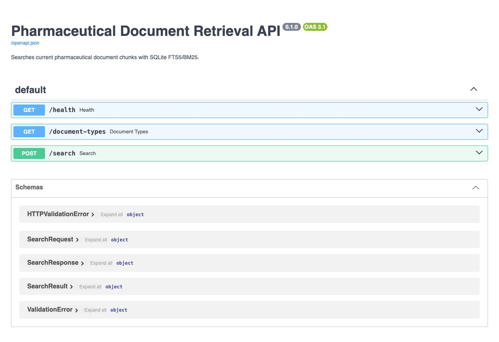

# Retrieval Serving Evidence

These screenshots record a local end-to-end serving check completed on August 18, 2026. FastAPI served the retrieval contract, and Gradio called that API as a separate browser client.

## Interface

The initial interface loads document-type filters from the API and lets the user control how many passages are returned.

## Grounded Retrieval

Test query:

> What must be completed before commercial distribution?

The top result was `fda-guidance-process-validation.pdf`, page 14. The passage states that process performance qualification must be completed successfully before commercial distribution. This matches the labeled retrieval evaluation for that source page.

The result view also shows retrieval latency, the source filename and page, the relative BM25 score, and a clear warning that the score is not a confidence probability.

## API Contract

FastAPI exposes health, document-type, and search endpoints. The generated OpenAPI page also documents the request, response, result, and validation schemas.

This evidence verifies local serving and browser behavior. It does not claim public hosting, concurrent-user capacity, or LLM-generated answer quality.
